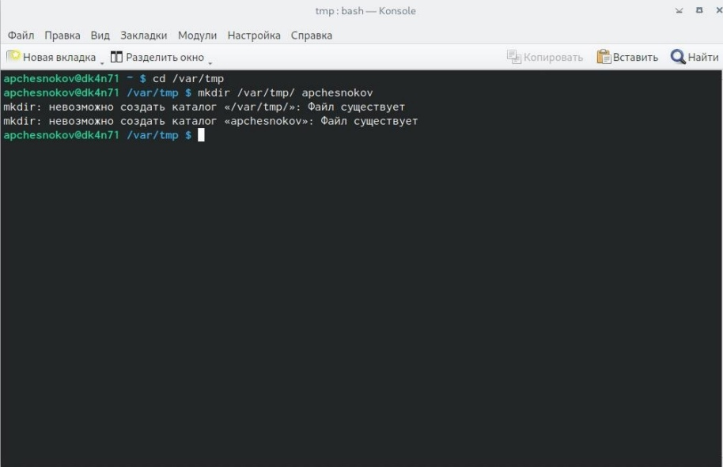
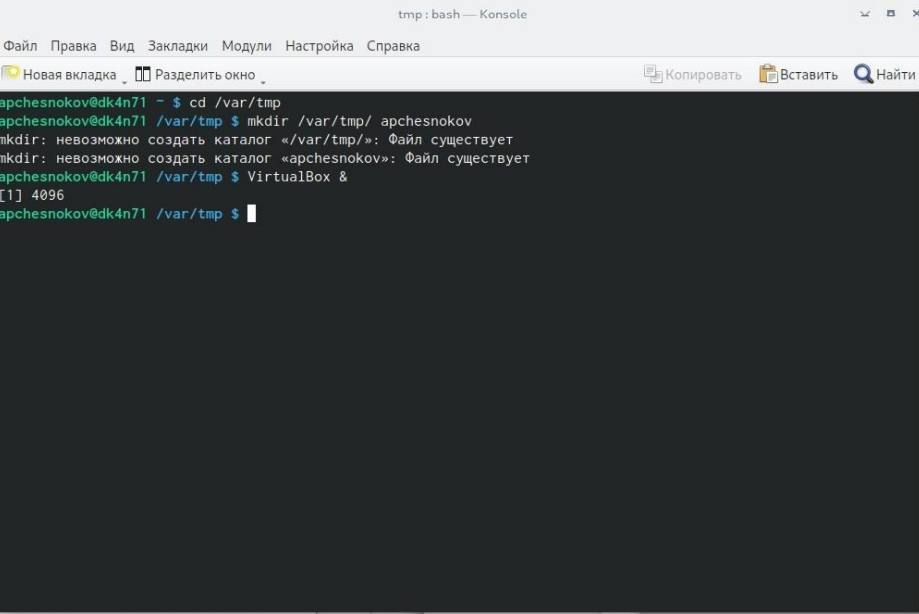
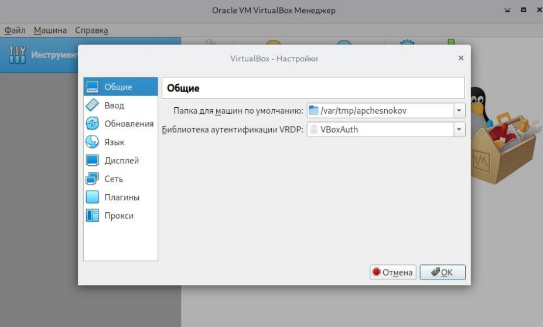
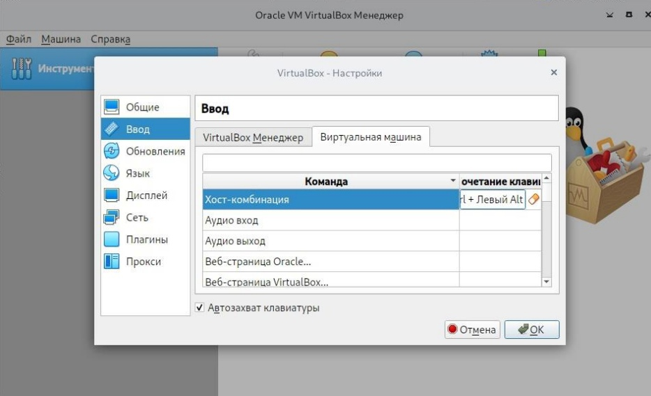
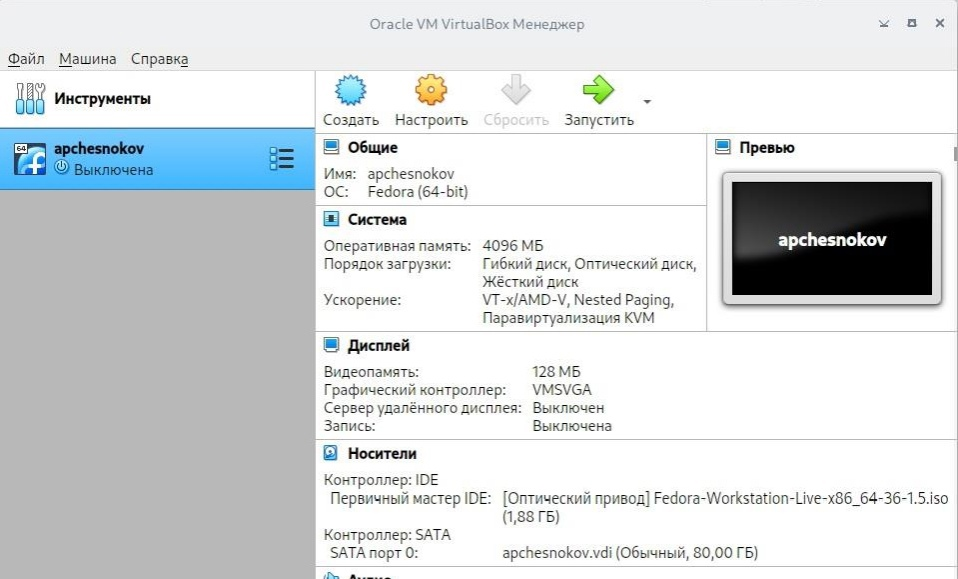
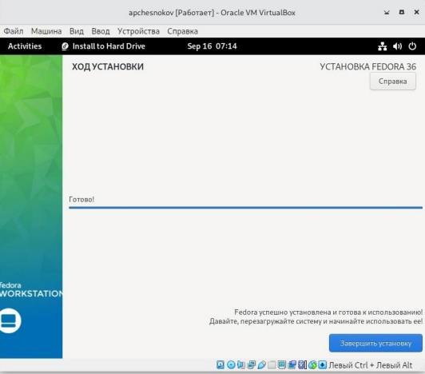
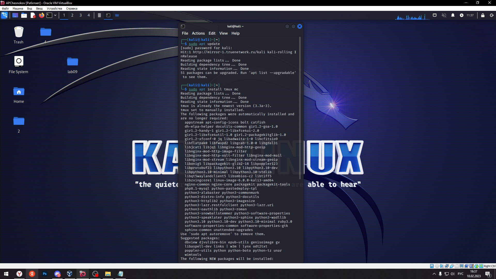
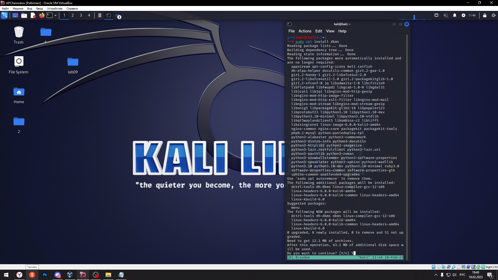
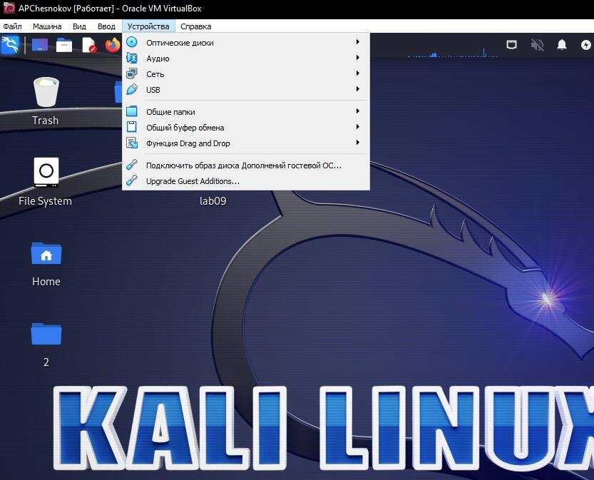
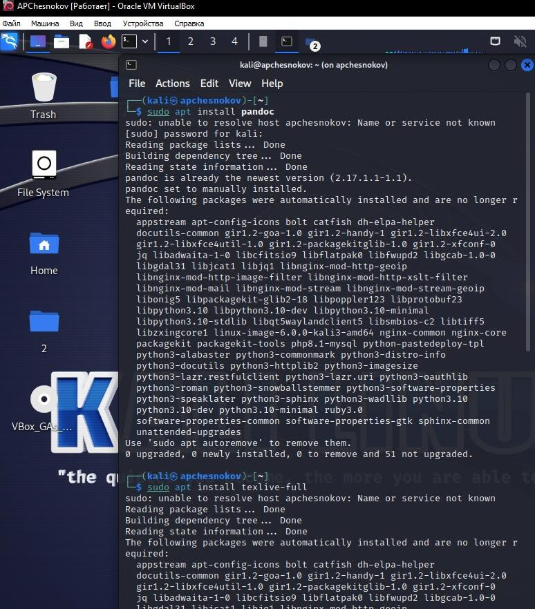

---
## Front matter
lang: ru-RU
title: Установка и конфигурация операционной системы на виртуальную машину
subtitle: 
author:
  - Чесноков А.П.
institute:
  - Российский университет дружбы народов, Москва, Россия
  - факультет физико-математических и естественных наук
date: 18 февраля 2023

## i18n babel
babel-lang: russian
babel-otherlangs: english

## Formatting pdf
toc: false
toc-title: Содержание
slide_level: 2
aspectratio: 169
section-titles: true
theme: metropolis
header-includes:
 - \metroset{progressbar=frametitle,sectionpage=progressbar,numbering=fraction}
 - '\makeatletter'
 - '\beamer@ignorenonframefalse'
 - '\makeatother'
---

# Информация

## Докладчик

:::::::::::::: {.columns align=center}
::: {.column width="70%"}

  * Чесноков Артемий Павлович
  * Студент, первый курс
  * Студент НПИбд-02-22
  * Российский университет дружбы народов
  * [1132222012@pfur.ru](1132222012@pfur.ru)
  * <https://github.com/Sinabon2004/study_2022-2023_os-intro>

:::
::: {.column width="30%"}

:::
::::::::::::::

## Цели и задачи

- Создать виртуальную машину, поставить на нее ОС
- Научиться пользоваться выбранной ОС на уровне командной строки

## Настроим каталог виртуальных машин (рис. @fig:001).

{#fig:001 width=50%}

##  Запускаем VirtualBox (рис. @fig:002).

{#fig:002 width=50%}

##  Указываем папку для виртуальных машин (рис. @fig:003).

{#fig:003 width=50%}

##  Настроим хост-клавишу (рис. @fig:004).

{#fig:004 width=50%}

## Запускаем виртуальную машину (рис. @fig:005).

{#fig:005 width=50%}

##  Устанавливаем ОС (рис. @fig:006).

{#fig:006 width=50%}

##  Установим необходимые Обновления (рис. @fig:007).

{#fig:007 width=50%}

##  Устанавливаем пакет DKMS (рис. @fig:008).

{#fig:008 width=50%}

##   Подключаем образ диска дополнений гостевой ОС (рис. @fig:009).

{#fig:009 width=50%}

##   Устанавливаем Pandoc и TeXlive (рис. @fig:010).

{#fig:010 width=50%}

## Итоговый слайд

- Таким образом, мы научились создавать виртуальную машину, устанавливать на нее ОС, а также научились устанавливать программное обеспечение при помощи командной строки.

