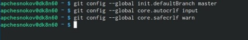
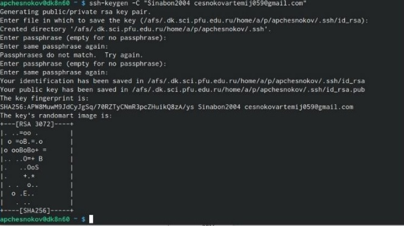
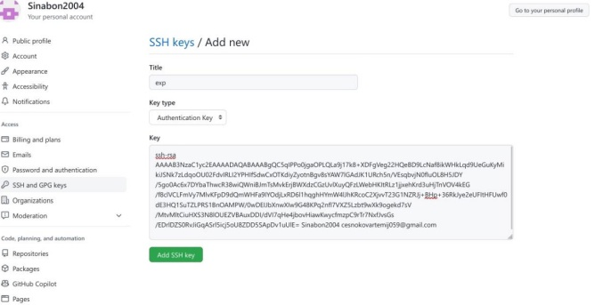
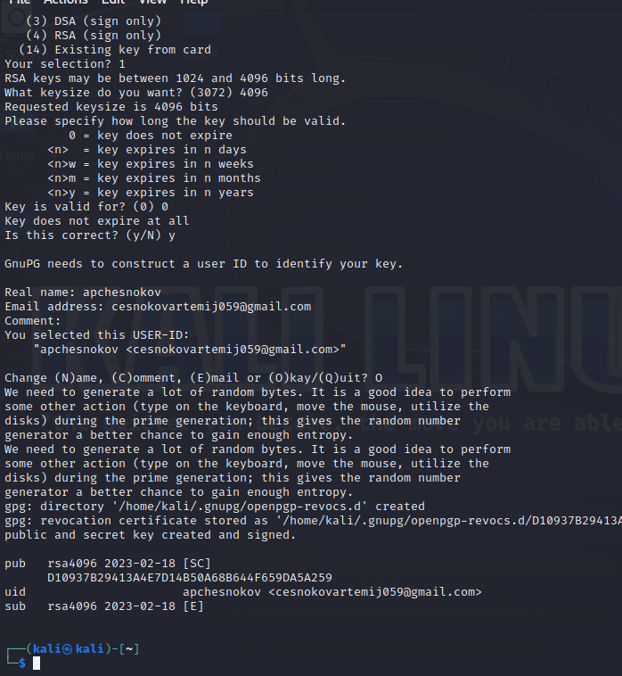
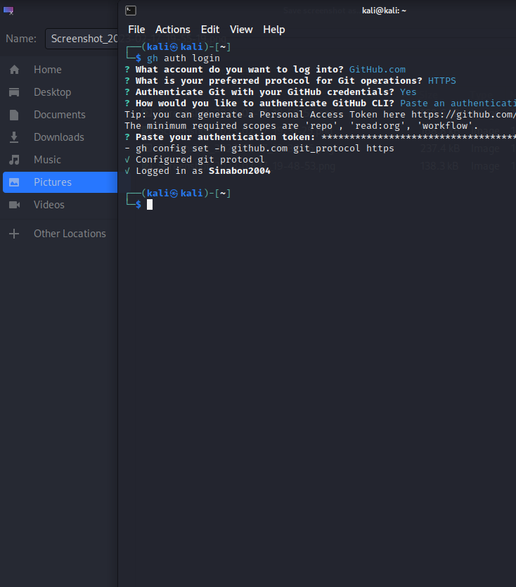
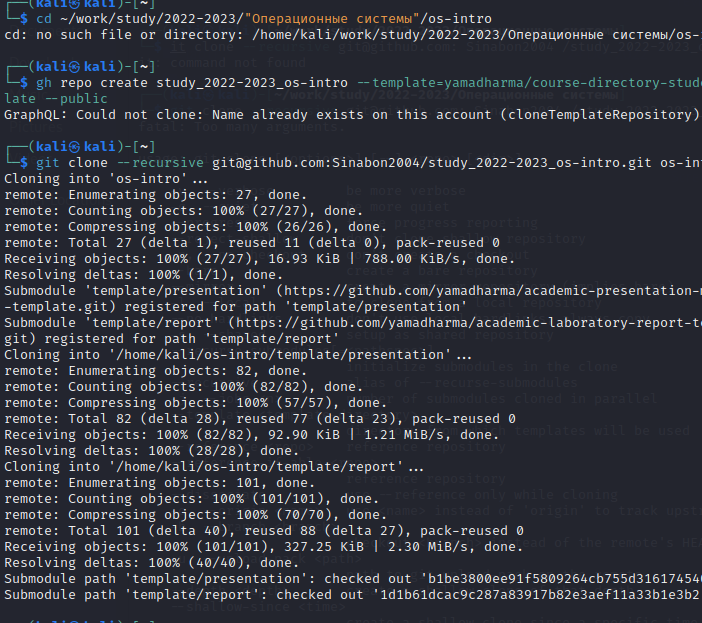
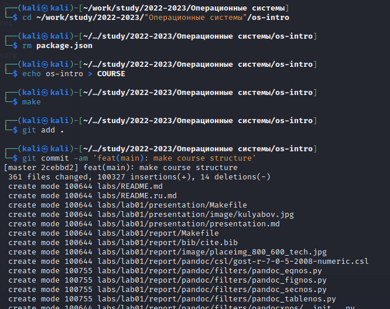

---
## Front matter
lang: ru-RU
title: Структура научной презентации
subtitle: Простейший шаблон
author:
  - Чесноков А.П.
institute:
  - Российский университет дружбы народов, Москва, Россия
  - факультет физико-математических и естественных наук
date: 18.02.2023

## i18n babel
babel-lang: russian
babel-otherlangs: english

## Formatting pdf
toc: false
toc-title: Содержание
slide_level: 2
aspectratio: 169
section-titles: true
theme: metropolis
header-includes:
 - \metroset{progressbar=frametitle,sectionpage=progressbar,numbering=fraction}
 - '\makeatletter'
 - '\beamer@ignorenonframefalse'
 - '\makeatother'
---

# Информация

## Докладчик

:::::::::::::: {.columns align=center}
::: {.column width="70%"}

  * Чесноков Артемий Павлович
  * Студент; Первый курс
  * Студент НПИбд-02-22
  * Российский университет дружбы народов
  * [1132222012@pfur.ru](1132222012@pfur.ru)  
  * <https://github.com/Sinabon2004/study_2022-2023_os-intro>

:::
::: {.column width="30%"}

:::
::::::::::::::

# Вводная часть
- Нам нужно освоить базовые навыки в использовании системы контроля версий git, а также заняться ее установкой

# Содержание исследования

- Наша задача создать репозиторий на github
- и всё необходимое

## Регистрируемся на сайте
Зайдем на официальный сайт Github и пройдем все этапы регистрации

{#fig:002 width=70%}

## Настраиваем систему

занимаемся настройкой целостной системы через командную строку

{#fig:004 width=70%}

## Генерируем SSH ключ

Срздаем SSH ключ для дальнейшей работы на Github

{#fig:006 width=70%}

## Вставляем ключ в Github

сюда мы вставляем ключ

{#fig:008 width=70%}

## Создаем PGP ключ 

тепеь создадим PGP ключч, который тоже необходим для дальнейшей работы

{#fig:009 width=70%}

## Авторизируемся в gh по командной строке

создаем возможность полноценного взаимодействия с репозиторие 

){#fig:011 width=60%}

## Создаем репозиторий курса на основе шаблона

Парой простых движений создаем репозиторий

){#fig:012 width=40%}

## Настраиваем каталог курса

настраиваем каталог курса

){#fig:013 width=40%}

## Итоговый слайд

- Таким образом, мы научились пользоваться системой контроля версий git
- системой контроля версий git

