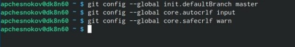
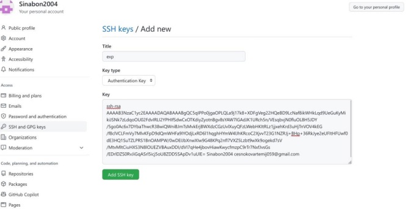

---
## Front matter
title: "Лабораторная работа №3"
subtitle: "Первоначальна настройка git"
author: "Чесноков Артемий Павлович НПИбд-02-22"

## Generic otions
lang: ru-RU
toc-title: "Содержание"

## Bibliography
bibliography: bib/cite.bib
csl: pandoc/csl/gost-r-7-0-5-2008-numeric.csl

## Pdf output format
toc: true # Table of contents
toc-depth: 2
lof: true # List of figures
lot: true # List of tables
fontsize: 12pt
linestretch: 1.5
papersize: a4
documentclass: scrreprt
## I18n polyglossia
polyglossia-lang:
  name: russian
  options:
	- spelling=modern
	- babelshorthands=true
polyglossia-otherlangs:
  name: english
## I18n babel
babel-lang: russian
babel-otherlangs: english
## Fonts
mainfont: PT Serif
romanfont: PT Serif
sansfont: PT Sans
monofont: PT Mono
mainfontoptions: Ligatures=TeX
romanfontoptions: Ligatures=TeX
sansfontoptions: Ligatures=TeX,Scale=MatchLowercase
monofontoptions: Scale=MatchLowercase,Scale=0.9
## Biblatex
biblatex: true
biblio-style: "gost-numeric"
biblatexoptions:
  - parentracker=true
  - backend=biber
  - hyperref=auto
  - language=auto
  - autolang=other*
  - citestyle=gost-numeric
## Pandoc-crossref LaTeX customization
figureTitle: "Рис."
tableTitle: "Таблица"
listingTitle: "Листинг"
lofTitle: "Список иллюстраций"
lotTitle: "Список таблиц"
lolTitle: "Листинги"
## Misc options
indent: true
header-includes:
  - \usepackage{indentfirst}
  - \usepackage{float} # keep figures where there are in the text
  - \floatplacement{figure}{H} # keep figures where there are in the text
---

# Цель работы

Изучить идеологию и применение системы контроля версий и
Освоить умения по работе с git.

# Выполнение лабораторной работы
1. С помощью команды sudo apt git установим git +  config настройка (рис. [-@fig:001]).

{#fig:001 width=70%}

2. Зайдем на официальный сайт Github (рис. [-@fig:002]).

{#fig:002 width=70%}

3. Проходим все этапы регистрации (рис. [-@fig:003]).

{#fig:004 width=70%}

4. Настраиваем систему (рис. [-@fig:004]).

{#fig:004 width=70%}

5. Продолжаем настривать систему (рис. [-@fig:005]).

{#fig:005 width=70%}

6. Генерируем SSH ключ (рис. [-@fig:006]).

{#fig:006 width=70%}

7. Копируем ключ (рис. [-@fig:007]).

{#fig:007 width=70%}

8. Вставляем ключ в Github (рис. [-@fig:008]).

{#fig:008 width=70%}

9. Создаем PGP ключ (рис. [-@fig:009]).

{#fig:009 width=70%}

10. Копируем ключ для Github (рис. [-@fig:010]).

{#fig:010 width=70%}

11. Добавляем ключ на Github аналогично SSH ключу в настройках.

12. Авторизируемся в gh по командной строке (рис. [-@fig:011]).

{#fig:011 width=70%}

13. Создаем репозиторий курса на основе шаблона (рис. [-@fig:012]).

{#fig:012 width=70%}

14. Настраиваем каталог курса (рис. [-@fig:013]).

{#fig:013 width=70%}

15. git push (рис. [-@fig:014]).

{#fig:014 width=70%}

# Выводы

Научились пользоваться git.
# Список литературы{.unnumbered}

::: {#refs}
:::
