---
## Front matter
lang: ru-RU
title: Структура научной презентации
subtitle: Простейший шаблон
author:
  - Кулябов Д. С.
institute:
  - Российский университет дружбы народов, Москва, Россия
  - Объединённый институт ядерных исследований, Дубна, Россия
date: 01 января 1970

## i18n babel
babel-lang: russian
babel-otherlangs: english

## Formatting pdf
toc: false
toc-title: Содержание
slide_level: 2
aspectratio: 169
section-titles: true
theme: metropolis
header-includes:
 - \metroset{progressbar=frametitle,sectionpage=progressbar,numbering=fraction}
 - '\makeatletter'
 - '\beamer@ignorenonframefalse'
 - '\makeatother'
---

# Информация

## Докладчик

:::::::::::::: {.columns align=center}
::: {.column width="70%"}

  * Чесноков артемий павлович
  * НПИбд-02-22, Студент
  * Российский университет дружбы народов
  * [1132222012@pfur.ru](1132222012@pfur.ru)
  * <https://Sinabon2004.github.io>

:::
::: {.column width="30%"}

:::
::::::::::::::

## Цели и задачи

- Научиться пользоваться командной строкой в Unix

##  Узнаем полнуы путь до домашнего каталога (рис. @fig:001).

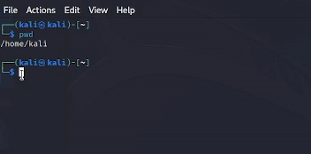{#fig:001 width=70%}

## Смотрим, что содержится в папке tmp (рис. @fig:002).

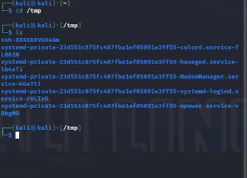{#fig:002 width=70%}

##  Узнаем подробности содержимого папки tmp (рис. @fig:003).

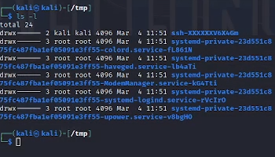{#fig:003 width=70%}

## Смотрим наличие папки cron в указанном каталоге (рис. @fig:004).

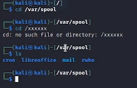{#fig:004 width=70%}

##  В домашнем каталоге создаем указанные папки (рис. @fig:005).

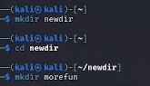{#fig:005 width=70%}

##  Создаем папки и удаляем их одной строкой (рис. @fig:006).

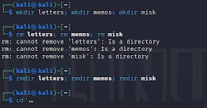{#fig:006 width=70%}

## Удаляем папку morefun(рис. @fig:007).

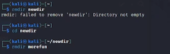{#fig:007 width=70%}

##  Смотрим документацию к команде ls (рис. @fig:008).

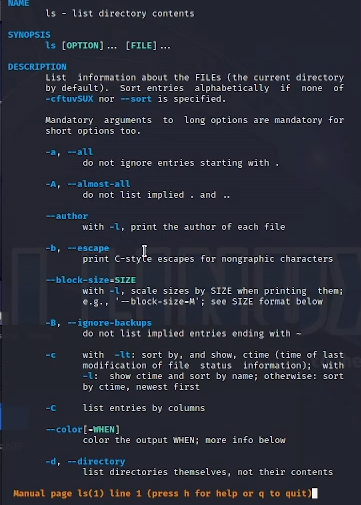{#fig:008 width=70%}

##  Смотрим полное  содержимое каталога (рис. @fig:009).

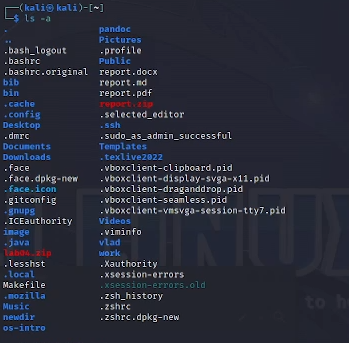{#fig:009 width=70%}

##  Сортируем по дате загрузки содержимое (рис. @fig:010).

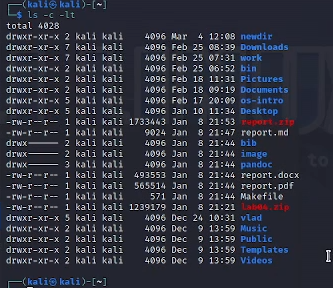{#fig:010 width=70%}

##  Смотрим документацию ко всем командам (рис. @fig:011).

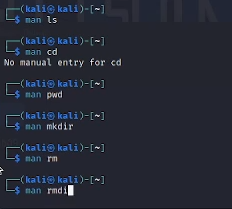{#fig:011 width=70%}

## Смотрим историю командной строки (рис. @fig:012).

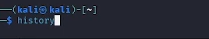{#fig:012 width=70%}

## Вызываем команду из истории действий (рис. @fig:013).

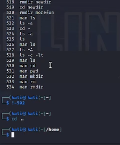{#fig:013 width=70%}

## Результаты

- УРА!!!! МЫ НАУЧИЛИСЬ ПОЛЬЗОВАТЬСЯ НЕКОТОРЫЕМИ КОМАНДАМИ В системе UNIX

