---
## Front matter
title: "Лабораторная работа №4"
subtitle: "Основы интерфейса взаимодействия пользователя с системой Unix на уровне командной строки"
author: "Чесноков Артемий Павлович НПИбд-02-22"

## Generic otions
lang: ru-RU
toc-title: "Содержание"

## Bibliography
bibliography: bib/cite.bib
csl: pandoc/csl/gost-r-7-0-5-2008-numeric.csl

## Pdf output format
toc: true # Table of contents
toc-depth: 2
lof: true # List of figures
lot: true # List of tables
fontsize: 12pt
linestretch: 1.5
papersize: a4
documentclass: scrreprt
## I18n polyglossia
polyglossia-lang:
  name: russian
  options:
	- spelling=modern
	- babelshorthands=true
polyglossia-otherlangs:
  name: english
## I18n babel
babel-lang: russian
babel-otherlangs: english
## Fonts
mainfont: PT Serif
romanfont: PT Serif
sansfont: PT Sans
monofont: PT Mono
mainfontoptions: Ligatures=TeX
romanfontoptions: Ligatures=TeX
sansfontoptions: Ligatures=TeX,Scale=MatchLowercase
monofontoptions: Scale=MatchLowercase,Scale=0.9
## Biblatex
biblatex: true
biblio-style: "gost-numeric"
biblatexoptions:
  - parentracker=true
  - backend=biber
  - hyperref=auto
  - language=auto
  - autolang=other*
  - citestyle=gost-numeric
## Pandoc-crossref LaTeX customization
figureTitle: "Рис."
tableTitle: "Таблица"
listingTitle: "Листинг"
lofTitle: "Список иллюстраций"
lotTitle: "Список таблиц"
lolTitle: "Листинги"
## Misc options
indent: true
header-includes:
  - \usepackage{indentfirst}
  - \usepackage{float} # keep figures where there are in the text
  - \floatplacement{figure}{H} # keep figures where there are in the text
---

# Цель работы

Приобретение практических навыков взаимодействия пользователя с системой посредством командной строки.

# Выполнение лабораторной работы

1. Узнаем полнуы путь до домашнего каталога (рис. @fig:001).

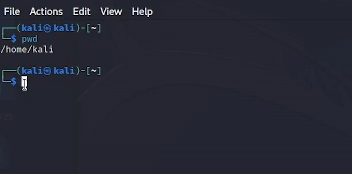{#fig:001 width=70%}

2. Смотрим, что содержится в папке tmp (рис. @fig:002).

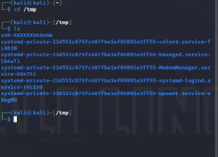{#fig:002 width=70%}

3. Узнаем подробности содержимого папки tmp (рис. @fig:003).

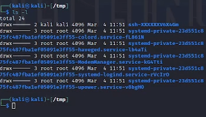{#fig:003 width=70%}

4. Смотрим наличие папки cron в указанном каталоге (рис. @fig:004).

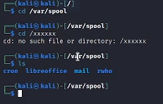{#fig:004 width=70%}

5. В домашнем каталоге создаем указанные папки (рис. @fig:005).

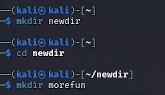{#fig:005 width=70%}

6. Создаем папки и удаляем их одной строкой (рис. @fig:006).

{#fig:006 width=70%}

7. Удаляем папку morefun(рис. @fig:007).

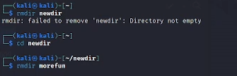{#fig:007 width=70%}

8. Смотрим документацию к команде ls (рис. @fig:008).

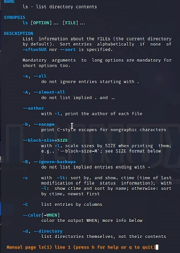{#fig:008 width=70%}

9. Смотрим полное  содержимое каталога (рис. @fig:009).

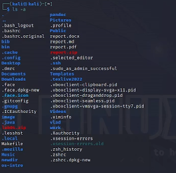{#fig:009 width=70%}

10. Сортируем по дате загрузки содержимое (рис. @fig:010).

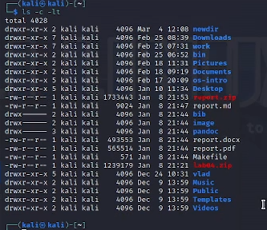{#fig:010 width=70%}

11. Смотрим документацию ко всем командам (рис. @fig:011).

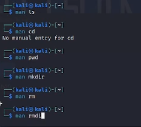{#fig:011 width=70%}

12. Смотрим историю командной строки (рис. @fig:012).

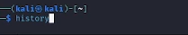{#fig:012 width=70%}

13. Вызываем команду из истории действий (рис. @fig:013).

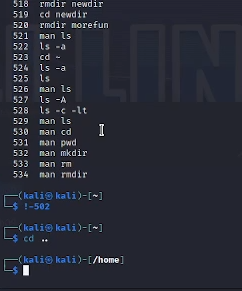{#fig:013 width=70%}

# Ответы на поставленные вопросы
1. Программа позволяющая управлять компьютером при помощи вводы текстовых команд
2. При помощи команды pwd
3. Команда file определяет тип файла
4. скрытые файлы можно отобразить с помощью ls -a
5. rm - удалить файл, rmdir - удалить папку
6. history
7. с помощью конструкции !-n , где n номер команды
8. rmdir a; rmdir b
9. Экранирование используется для вывода, например, какой-либо команды. C помощью \ перед
10. ls -l печатает содержимое в формате списка, где описаны наборы различной информации
11. Относительный - начиная с текущей папки, абсолютный - начиная с корневой
12. с помощью команды man + интересующая команда
13. -->

# Выводы

Приобрели навыки в работе с командной строкой в системе UNIX

# Список литературы{.unnumbered}

::: {#refs}
:::
