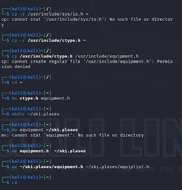
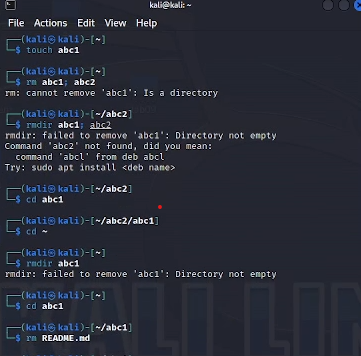
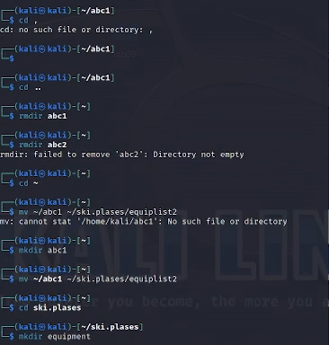
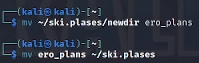
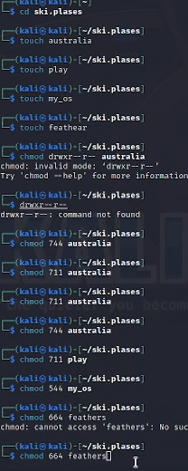
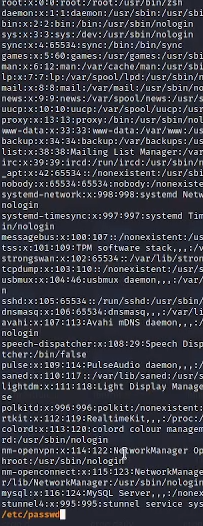
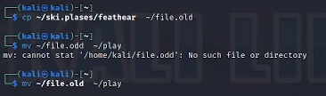
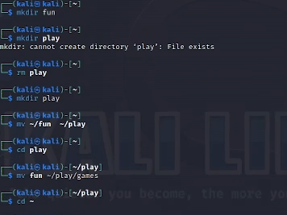
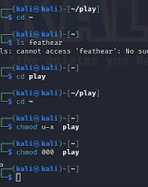
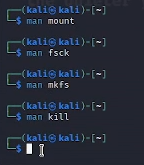

---
## Front matter
lang: ru-RU
title: Структура научной презентации
subtitle: Простейший шаблон
author:
  - Кулябов Д. С.
institute:
  - Российский университет дружбы народов, Москва, Россия
  - Объединённый институт ядерных исследований, Дубна, Россия
date: 01 января 1970

## i18n babel
babel-lang: russian
babel-otherlangs: english

## Formatting pdf
toc: false
toc-title: Содержание
slide_level: 2
aspectratio: 169
section-titles: true
theme: metropolis
header-includes:
 - \metroset{progressbar=frametitle,sectionpage=progressbar,numbering=fraction}
 - '\makeatletter'
 - '\beamer@ignorenonframefalse'
 - '\makeatother'
---

# Информация

## Докладчик

:::::::::::::: {.columns align=center}
::: {.column width="70%"}

  * Чесноков Артемий Павлович
  * Студент НПИбд-02-22
  * Российский университет дружбы народов
  * [1132222012@pfur.ru](1132222012@pfur.ru)
  * <https://Sinabon2004.github.io/ru/>

:::
::: {.column width="30%"}

:::
::::::::::::::

# Вводная часть

## Цели и задачи

- Ознакомление с файловой системой Linux, её структурой, именами и содержанием
каталогов. Приобретение практических навыков по применению команд для работы
с файлами и каталогами, по управлению процессами (и работами), по проверке использования диска и обслуживанию файловой системы.

## Копируем из /ect/include любой файл в доомашний каталог и переименовываем+перемещаем его  (рис. @fig:001).

{#fig:001 width=70%}

## Создается объект abc а в нем md файл (рис. @fig:002).

{#fig:002 width=70%}

## Удаляем старое, добавляем equipment(рис. @fig:003).

{#fig:003 width=70%}

## Вдобавок создаем каталог ero_plans (рис. @fig:004).

{#fig:004 width=70%}

## Создание файлов и изменение доступа к ним (рис. @fig:005).

{#fig:005 width=70%}

## Смотрим содержимое файла passwd (рис. @fig:006).

{#fig:006 width=70%}

## Создаем file.old и переименовываем его (рис. @fig:007).

{#fig:007 width=70%}

## Создаем каталог fun и перекидываем его  в play + переименовываем (рис. @fig:008).

){#fig:008 width=70%}

## Меняем доступ к директории (рис. @fig:009).

{#fig:009 width=70%}

## Спомощью команды man узнаем значение новых команд.

{#fig:010 width=70%}

## Результаты

- Таким образом, мы научились пользоваться файловой системой Linux и приобрели навыки в использовании различных команд.

