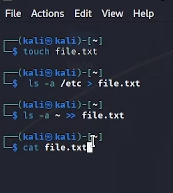
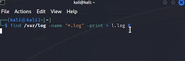
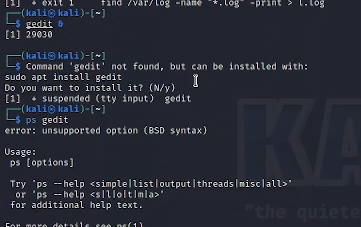
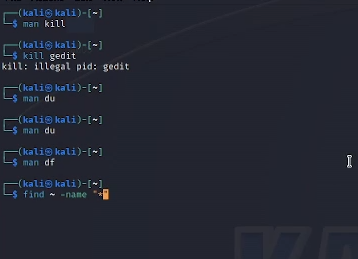

---
## Front matter
lang: ru-RU
title: Структура научной презентации
subtitle: Простейший шаблон
author:
  - Кулябов Д. С.
institute:
  - Российский университет дружбы народов, Москва, Россия
  - Объединённый институт ядерных исследований, Дубна, Россия
date: 01 января 1970

## i18n babel
babel-lang: russian
babel-otherlangs: english

## Formatting pdf
toc: false
toc-title: Содержание
slide_level: 2
aspectratio: 169
section-titles: true
theme: metropolis
header-includes:
 - \metroset{progressbar=frametitle,sectionpage=progressbar,numbering=fraction}
 - '\makeatletter'
 - '\beamer@ignorenonframefalse'
 - '\makeatother'
---

# Информация

## Докладчик

:::::::::::::: {.columns align=center}
::: {.column width="70%"}

  * Чесноков артемий павлович
  * НПИбд-02-22, Студент
  * Российский университет дружбы народов
  * [1132222012@pfur.ru](1132222012@pfur.ru)
  * <https://Sinabon2004.github.io>

:::
::: {.column width="30%"}

:::
::::::::::::::

# Цель работы

Ознакомление с инструментами поиска файлов и фильтрации текстовых данных.
Приобретение практических навыков: по управлению процессами (и заданиями), по
проверке использования диска и обслуживанию файловых систем

# Выполнение лабораторной работы

 Записали соедержимое /etc в file.txt  

# Выполнение лабораторной работы
Записали все файлы .conf в текстовый файл 

# Выполнение лабораторной работы

 Нашли все .log файлы

# Выполнение лабораторной работы

 Запустили gedit в фоновом режиме 

# Выполнение лабораторной работы

 Ознакомились с опциями новых команд 

# Выводы

В ходе выполнения лабораторной работы мы ознакомились с инструментами поиска файлов и фильтрации текстовых данных. Приобрели практические навыки: по управлению процессами (и заданиями), по проверке использования диска и обслуживанию файловых систем.

