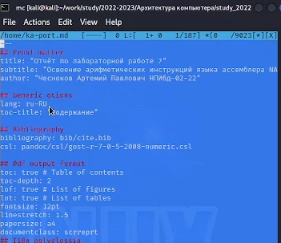

---
## Front matter
lang: ru-RU
title: Структура научной презентации

author:
  - Чесноков А.П.
institute:
  - Российский университет дружбы народов, Москва, Россия
  - Объединённый институт ядерных исследований, Дубна, Россия
date: 01 января 1970

## i18n babel
babel-lang: russian
babel-otherlangs: english

## Formatting pdf
toc: false
toc-title: Содержание
slide_level: 2
aspectratio: 169
section-titles: true
theme: metropolis
header-includes:
 - \metroset{progressbar=frametitle,sectionpage=progressbar,numbering=fraction}
 - '\makeatletter'
 - '\beamer@ignorenonframefalse'
 - '\makeatother'
---

# Информация

## Докладчик

:::::::::::::: {.columns align=center}
::: {.column width="70%"}

  * Чесноков артемий павлович
  * НПИбд-02-22, Студент
  * Российский университет дружбы народов
  * [1132222012@pfur.ru](1132222012@pfur.ru)
  * <https://Sinabon2004.github.io>

:::
::: {.column width="30%"}

# Цель работы

- Освоение основных возможностей командной оболочки Midnight Commander. Приобретение навыков практической работы по просмотру каталогов и файлов; манипуляций
с ними.

## Выполнение лабораторной работы

##  Ознакомились с mc  и открыли (рис. @fig:001).

{#fig:001 width=70%}

##  Ознакомились с интерфейсом (рис. @fig:002).

{#fig:002 width=70%}

##  Скопировали произвольный файл в другую директорию(рис. @fig:003).

{#fig:003 width=70%}

##  Перенесли произвольный файл в другую директорию (рис. @fig:004).

{#fig:004 width=70%}

##  Отредактировали произвольный файл (рис. @fig:005).

{#fig:005 width=70%}

##  Сделали поиск файлов по их имени (рис. @fig:006).

{#fig:006 width=70%}

##  Создали текстовый файл по заданию (рис. @fig:007).

{#fig:007 width=70%}

##  Попробовали все команды из задания (рис. @fig:008).

{#fig:008 width=70%}

## Выводы

- В ходе выполнения лабораторной работы мы ознакомились с MC и научились с его помощью редактировать файлы
