---
## Front matter
lang: ru-RU
title: Структура научной презентации
subtitle: Простейший шаблон
author:
  - Чесноков Артемий Павлович
institute:
  - Российский университет дружбы народов, Москва, Россия
  - Факультет физико-математических и естественных наук
date: 25 февраля 2023

## i18n babel
babel-lang: russian
babel-otherlangs: english

## Formatting pdf
toc: false
toc-title: Содержание
slide_level: 2
aspectratio: 169
section-titles: true
theme: metropolis
header-includes:
 - \metroset{progressbar=frametitle,sectionpage=progressbar,numbering=fraction}
 - '\makeatletter'
 - '\beamer@ignorenonframefalse'
 - '\makeatother'
---

# Информация

## Докладчик

:::::::::::::: {.columns align=center}
::: {.column width="70%"}

  * Чесноков Артемий Павлович
  * Студент НПИбд-02-22
  * Российский университет дружбы народов
  * [1132222012@pfur.ru](1132222012@pfur.ru)
  * <https://github.com/Sinabon2004>

:::
::: {.column width="30%"}

:::
::::::::::::::

# Вводная часть

## Цели и задачи

- Установить необходимое ПО
- Создать шаблон для будущего сайта

## Начало работы

- Переходим по ссылке (рис. @fig:001).

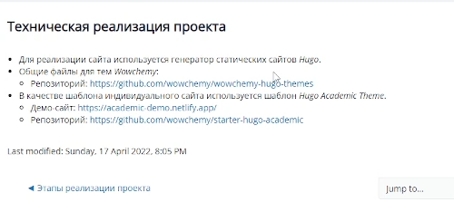{#fig:001 width=70%}

## Устоновка ПО

- Скачиваем hugo (рис. @fig:002).

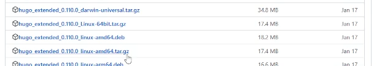{#fig:002 width=70%}

## Каталог bin

- Переносим программу в указанное место + создаем каталог bin (рис. @fig:003).

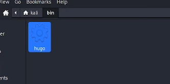{#fig:003 width=70%}

## Находим шаблон для сайта

- Переходим по ссылке для шаблона для сайта (рис. @fig:004).

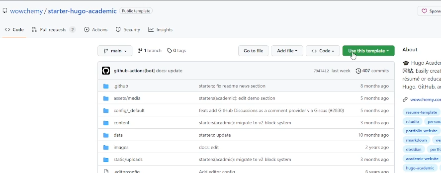{#fig:004 width=70%}

## Работаем с репозиторием

- Клонируем репозиторий (рис. @fig:005).

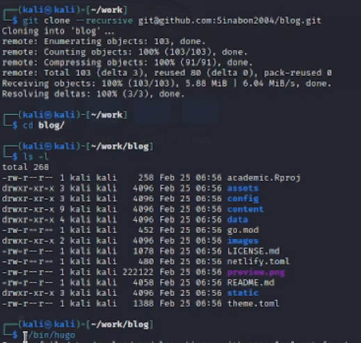{#fig:005 width=70%}

## Сервер

- Создаем сервер (рис. @fig:006).

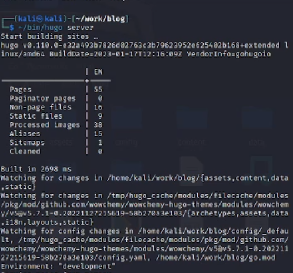{#fig:006 width=70%}

## Модификация шаблона

- Удаляем demo часть сайта в шаблоне (рис. @fig:007).

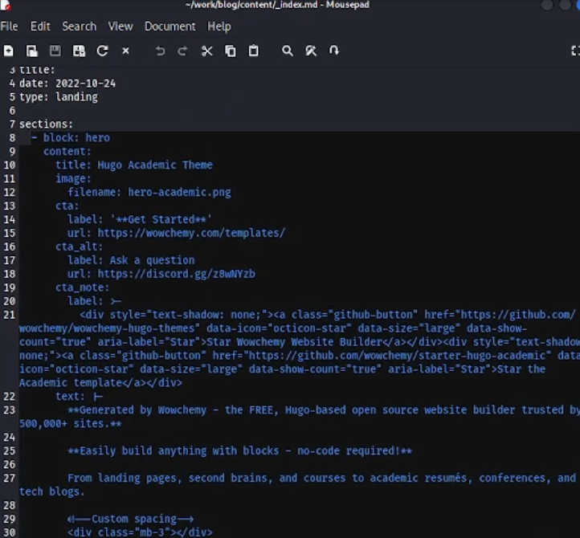{#fig:007 width=70%}

## Репозиторий на сайт

- Создаем репозиторий четко по рисунку (рис. @fig:008).

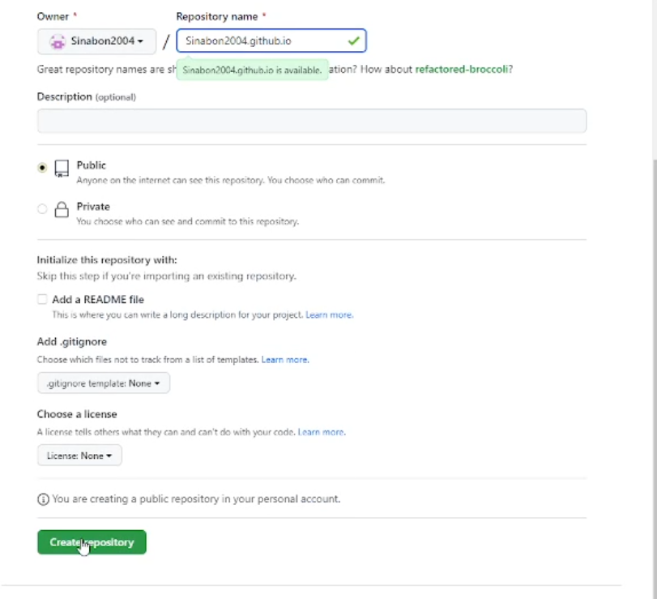{#fig:008 width=70%}

## Проверка

- Проверяем наличие репозитория blog (рис. @fig:009).

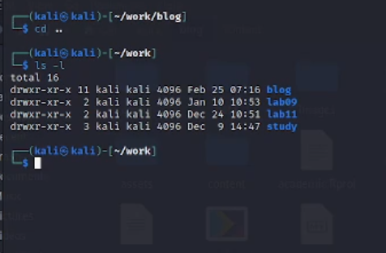{#fig:009 width=70%}

## Выкладываем

- После создания именного репозитория, пушим его в гитхаб (рис. @fig:010).

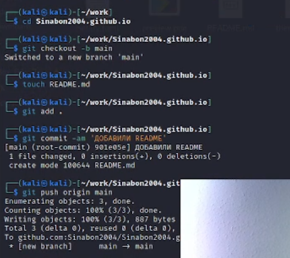{#fig:001 width=70%}

## Удаляем ненужное

- Убираем папку public и делаем submodule (рис. @fig:011).

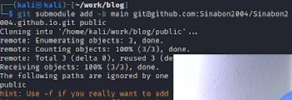{#fig:001 width=70%}

## Проверка

- Проверяем привязку и высылаем на репозиторий в github (рис. @fig:012).

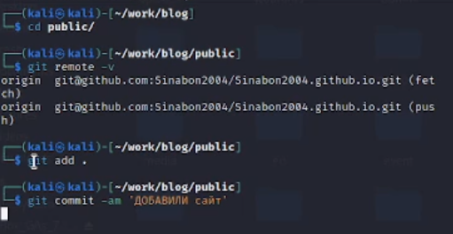{#fig:001 width=70%}

## Шаблон для сайта готов

- Сайт готов и работает исправно (рис. @fig:013).

{#fig:001 width=70%}

## Итоговый слайд

- Таким образом, мы научились пользоваться hugo для создания сайтов, а также выложивли всё в на github

