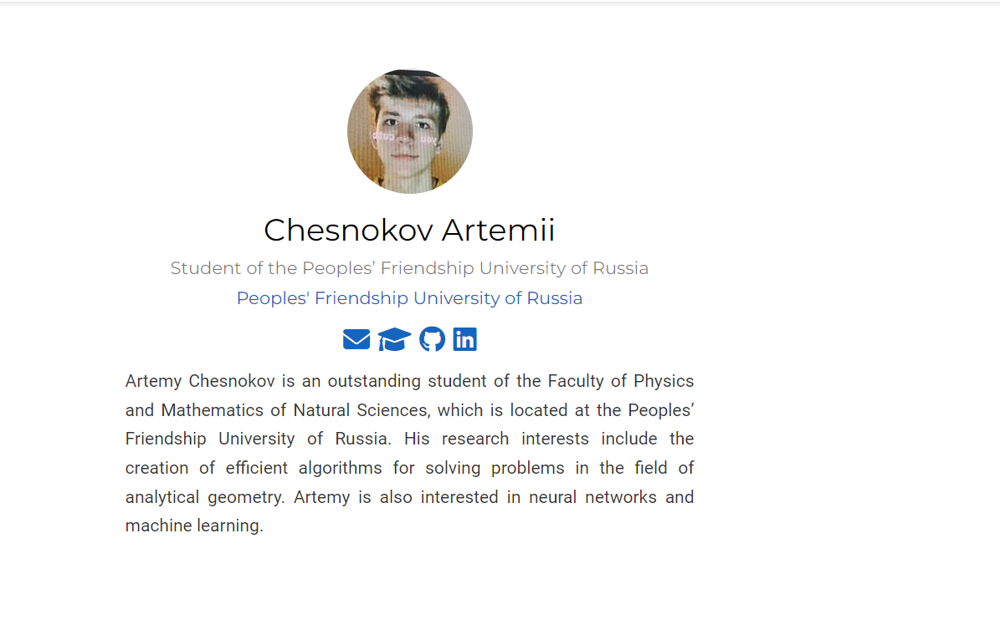
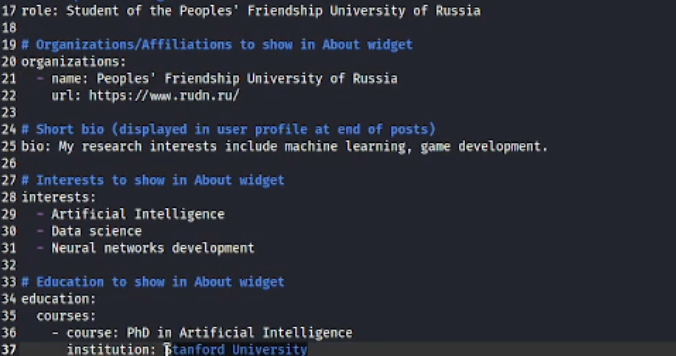
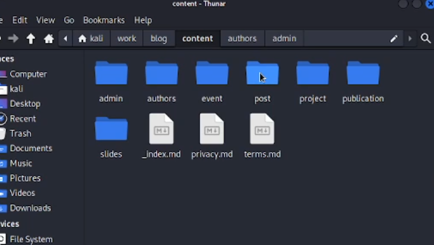
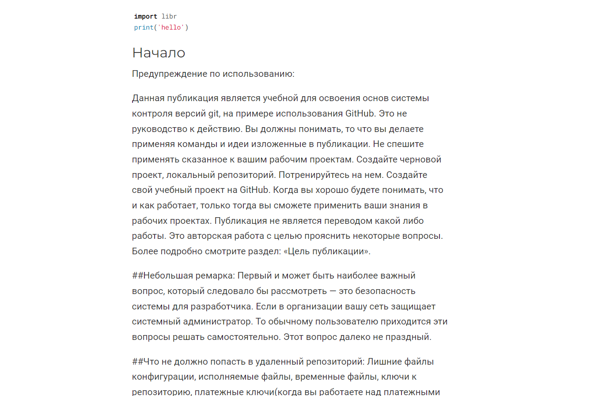

---
## Front matter
lang: ru-RU
title: Структура научной презентации
subtitle: Простейший шаблон
author:
  - Чесноков Артемий Павлович
institute:
  - Российский университет дружбы народов, Москва, Россия
  - Факультет физико-математических и естественных наук
date: 25 февраля 2023

## i18n babel
babel-lang: russian
babel-otherlangs: english

## Formatting pdf
toc: false
toc-title: Содержание
slide_level: 2
aspectratio: 169
section-titles: true
theme: metropolis
header-includes:
 - \metroset{progressbar=frametitle,sectionpage=progressbar,numbering=fraction}
 - '\makeatletter'
 - '\beamer@ignorenonframefalse'
 - '\makeatother'
---

# Информация

## Докладчик

:::::::::::::: {.columns align=center}
::: {.column width="70%"}

  * Чесноков Артемий Павлович
  * Студент НПИбд-02-22
  * Российский университет дружбы народов
  * [1132222012@pfur.ru](1132222012@pfur.ru)
  * <https://github.com/Sinabon2004>

:::
::: {.column width="30%"}

:::
::::::::::::::

## Цели и задачи

- Установить необходимое ПО
- Создать шаблон для будущего сайта

## Начало работы

- В /home/kali/work/blog/content/ меняем наши текстовые данные + в /home/kali/work/blog/content/authors/admin/ меняем аватар.

## МЕНЯЕМ ДАННЫЕ

- Изменяем данные под себя, меняем блок интересы и блок образование.

## статья про последнюю неделю

- Создаем запись в каталоге post.

## статья про git

- Аналогично создаем статью по системе контроля версий git .

## Итоговый слайд

- Таким образом, мы научились пользоваться hugo для создания сайтов, а также выложивли всё в на github

